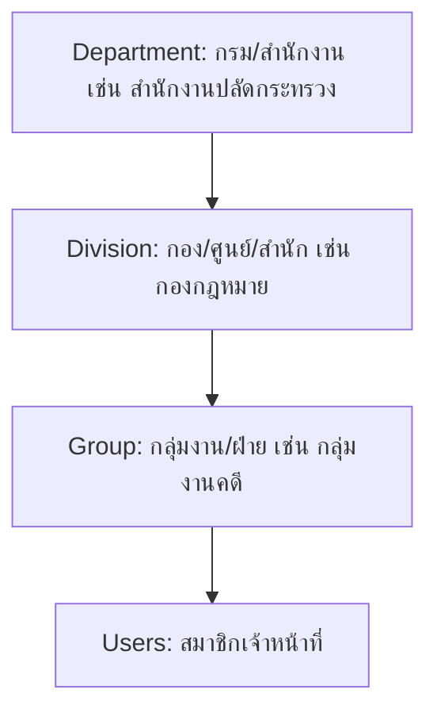

# แผนการออกแบบโครงสร้างสิทธิ์การเข้าถึงข้อมูลตามผังองค์กรในอนาคต (Future RBAC & Org-Structure Plan)

เอกสารฉบับนี้จัดทำขึ้นเพื่อวางแนวทางสถาปัตยกรรมความปลอดภัยและการเข้าถึงข้อมูลคลังไฟล์ในอนาคต โดยมุ่งเน้นการเชื่อมโยงระบบควบคุมสิทธิ์แบบ **RBAC** เข้ากับ **โครงสร้างองค์กร 3 ระดับ** ของกระทรวงสาธารณสุข เพื่อให้ระบบสามารถรองรับการขยายตัวและปรับเปลี่ยนนโยบายความมั่นคงปลอดภัยได้ในระยะยาว

---

## 🌌 1. แผนการพัฒนาการควบคุมสิทธิ์ตามโครงสร้างองค์กร (RBAC & Org-Structure Permissions)

ในการสเกลระบบในอนาคต โครงสร้างสิทธิ์จะไม่เพียงผูกกับบทบาทของผู้ใช้ (เช่น Admin, Editor) แบบลอยๆ แต่จะถูกตรวจสอบร่วมกับ **สังกัดการทำงาน** และ **ระดับการเข้าถึงโครงสร้างข้อมูล** ด้วย

### 1.1 การควบคุมการเข้าถึงตามบทบาท (Role-Based Access Control - RBAC)
* **การใช้สถาปัตยกรรมร่วมกับ CodeIgniter Shield:**
  - ใช้ตาราง `auth_groups_users` และ `auth_permissions_users` ของ CI Shield เป็นพื้นฐานหลัก
  - กำหนดบทบาทมาตรฐาน (System Roles) ได้แก่:
    1. **Super Admin:** สิทธิ์สูงสุด ดูแลจัดการระบบทั้งหมด ทุกกองงาน และการตั้งค่าระบบ
    2. **Division Admin (ผู้ดูแลระบบระดับกอง/กรม):** จัดการสมาชิกและไฟล์ทั้งหมดในสังกัดของตนเอง
    3. **Officer (เจ้าหน้าที่ผู้บันทึก):** สิทธิ์เขียน อ่าน และแก้ไขข้อมูลไฟล์/MOU เฉพาะกลุ่มงานตนเอง
    4. **Reader (ผู้เข้าดู):** สิทธิ์อ่านและดาวน์โหลดเท่านั้น ไม่มีสิทธิ์แก้ไข
* **การตรวจสอบสิทธิ์ระดับ Middleware:**
  - สร้าง CodeIgniter Route Filter เช่น `RbacFilter` เพื่อดักจับทุกคำขอ URL และสแกนสิทธิ์โดยเชื่อมโยงผ่าน `service('auth')->user()->hasPermission($permission)`

### 1.2 ระบบจัดการบัญชีผู้ใช้ (Users Management)
* **การพัฒนา UI/UX สำหรับผู้ดูแลระบบ:**
  - หน้าแสดงรายการผู้ใช้ทั้งหมดในรูปแบบ Grid/Table ที่รองรับการค้นหา กรองตามสังกัด และกรองตามสถานะ (Active/Inactive)
  - แบบฟอร์มเพิ่ม/แก้ไขข้อมูลผู้ใช้: กำหนดบทบาทสิทธิ์ (Roles), กลุ่มความปลอดภัย (Groups) และกำหนดสังกัดการทำงาน
  - ระบบตรวจสอบนโยบายรหัสผ่าน (Password Policy) และการส่งลิงก์รีเซ็ตรหัสผ่านแบบปลอดภัยผ่านระบบอีเมลราชการ

### 1.3 รายละเอียดข้อมูลส่วนตัวและตำแหน่งข้าราชการ (User Profile & Civil Service Metadata)
เพื่อรองรับโครงสร้างข้อมูลประวัติและข้อมูลข้าราชการพลเรือนของกระทรวงสาธารณสุข ตารางข้อมูลโปรไฟล์ผู้ใช้งาน (เช่น `lomc4_user_profiles`) หรือฟิลด์เพิ่มเติมในตารางผู้ใช้หลักจะประกอบด้วย:
1. **คำนำหน้าชื่อ (Prefix / Title):** เช่น นาย / นาง / นางสาว / ดร. / นายแพทย์
2. **ชื่อจริง (First Name) & นามสกุล (Last Name)**
3. **ตำแหน่งในสายงาน (Job Position):** เช่น นิติกร, นักวิเคราะห์นโยบายและแผน, นักจัดการงานทั่วไป
4. **ระดับตำแหน่ง (Position Level):** เช่น ปฏิบัติงาน, ปฏิบัติการ, ชำนาญการ, ชำนาญการพิเศษ, เชี่ยวชาญ, ทรงคุณวุฒิ
5. **ประเภทของข้าราชการพลเรือน (Civil Service Type):** กำหนดกลุ่มตามโครงสร้างราชการพลเรือนไทย:
   - **ทั่วไป / ปฏิบัติงาน (General / Operational)**
   - **วิชาการ (Professional / Knowledge Worker)**
   - **อำนวยการ (Executive / Division Director)**
   - **ผู้บริหาร (Senior Executive / Department Director)**

### 1.4 ระบบจัดการโครงสร้างองค์กร 3 ระดับ (Department, Division, and Group Management)
เพื่อสอดรับกับโครงสร้างการจัดตั้งหน่วยงานของกระทรวงสาธารณสุข ระบบจะกำหนดโครงสร้างตาราง DB เป็นลำดับขั้น (Hierarchical Structure):

* **ตารางฐานข้อมูลที่จะถูกเพิ่มเติม:**
  1. **`lomc4_departments` (ระดับกรม/สำนักงาน):** เก็บข้อมูล `id`, `name`, `short_name`
  2. **`lomc4_divisions` (ระดับกอง/ศูนย์/สำนัก):** เก็บข้อมูล `id`, `department_id` (FK), `name`, `short_name`
  3. **`lomc4_groups` (ระดับกลุ่มงาน/ฝ่าย):** เก็บข้อมูล `id`, `division_id` (FK), `name`
* **การกำหนดสิทธิ์และความเป็นเจ้าของข้อมูล (Data Ownership Scoping):**
  - **ไฟล์และโฟลเดอร์** จะมีฟิลด์ระบุความเป็นเจ้าของ: `owner_group_id`, `owner_division_id`
  - **ตรรกะการตรวจสอบการเข้าถึงสิทธิ์ (Scope Resolution):**
    - หากผู้ใช้เป็น `Officer` สังกัด *กลุ่มงาน A* จะมีสิทธิ์เข้าถึงเฉพาะโฟลเดอร์/ไฟล์ที่ผูกกับ *กลุ่มงาน A* เท่านั้น
    - หากผู้ใช้เป็น `Division Admin` สังกัด *กอง B* จะสามารถจัดการไฟล์ของทุกกลุ่มงานย่อยที่สังกัดใต้ *กอง B* ได้โดยอัตโนมัติ (การสืบทอดสิทธิ์จากบนลงล่าง)

---

## 🔍 2. การวิเคราะห์ทางสถาปัตยกรรมและประเด็นที่ต้องคำนึงถึง (Analytical Breakdown)

หากต้องการนำแผนงานด้านบนไปพัฒนาจริงในอนาคต มีประเด็นทางวิศวกรรมซอฟต์แวร์ที่สำคัญและห้ามตกหล่นดังนี้:

### 2.1 การย้ายสังกัดและสถานะพนักงาน (User Reassignments & Transfers)
* **ความท้าทาย:** เมื่อเจ้าหน้าที่ย้ายกลุ่มงาน (เช่น ย้ายจากกลุ่มงานคดี ไปกลุ่มงานกฎหมายแพ่ง) หรือย้ายกองงาน สิทธิ์ในระบบคลังไฟล์ต้องเปลี่ยนแปลงอย่างไร?
* **ข้อกำหนดแนวทาง:**
  - **ระบบ Dynamic Re-assignment:** เมื่อเปลี่ยนกลุ่มงานในหน้าประวัติผู้ใช้ สิทธิ์การเข้าถึงไฟล์ในระบบของผู้นั้นต้องอัปเดตทันทีตามพิกัดกลุ่มงานใหม่
  - **ประเด็นเอกสารเดิม:** ต้องกำหนดทางเลือกว่าไฟล์ที่ผู้ใช้คนดังกล่าวเคยอัปโหลดไว้ตอนอยู่กลุ่มงานเดิม จะยังคงเป็นของกลุ่มงานเดิม (เป็นสมบัติของกองงาน) หรือย้ายตามผู้ใช้ไป (โดยปกติ แนะนำให้สิทธิ์การเป็นเจ้าของไฟล์ผูกกับ "กลุ่มงาน" ไม่ใช่ตัวบุคคลผู้สร้าง เพื่อป้องกันไฟล์หายเมื่อมีคนลาออก/โยกย้าย)

### 2.2 ประสิทธิภาพการสืบค้นโครงสร้างสิทธิ์ (Query Performance at Scale)
* **ความท้าทาย:** การ JOIN ตาราง 3 ระดับองค์กร ร่วมกับตารางโฟลเดอร์ ไฟล์ และข้อมูลผู้ใช้ เพื่อสแกนสิทธิ์ในทุกๆ คำขอการโหลดไฟล์ อาจทำให้ฐานข้อมูลทำงานหนักและเกิดอาการคอขวด (Query Bottleneck)
* **ข้อกำหนดแนวทาง:**
  - **การใช้ Recursive CTEs / Closure Tables:** สำหรับการแกะรอยโฟลเดอร์ย่อยระดับลึกว่าผู้ใช้มีสิทธิ์ในโฟลเดอร์แม่หรือไม่ แนะนำให้จัดเก็บโครงสร้างความสัมพันธ์ในรูปแบบ **Closure Table** หรือคิวรีผ่าน **Recursive Common Table Expressions (CTEs)** ของ MySQL 8.0+
  - **ระบบเก็บสถานะชั่วคราว (Cache Permission State):** ทำการ Cache รายการสิทธิ์และรหัสกลุ่มงาน/กองงานที่ผู้ใช้รายนั้นเข้าถึงได้ไว้ใน Session หรือ Redis Cache และล้าง Cache (Clear cache) เฉพาะเมื่อมีการอัปเดตสิทธิ์หรือย้ายกลุ่มงานเท่านั้น เพื่อลดเวลาการทำคิวรีฐานข้อมูลเหลือ 0 ms ในกรณีคำขอปกติ

### 2.3 การแชร์ไฟล์ข้ามสังกัดและการร่วมมือกัน (Cross-Organizational File Sharing)
* **ความท้าทาย:** เจ้าหน้าที่กลุ่มงานคดี ต้องการแชร์ไฟล์กฎหมายตัวอย่างชิ้นหนึ่งให้เพื่อนในกลุ่มงานวินัยเข้าถึง แต่โครงสร้างความเป็นเจ้าของ (Ownership) ยึดตามกลุ่มงานตนเอง
* **ข้อกำหนดแนวทาง:**
  - ต้องจัดทำตารางกลาง **`lomc4_file_shares`** สำหรับทำสิทธิ์แชร์พิเศษข้ามกลุ่มงาน ประกอบด้วยฟิลด์ `file_uuid`, `target_group_id`, `target_division_id`, `permission_type` (view/download) แทนการคัดลอกไฟล์ซ้ำซ้อนซึ่งจะทำลายความถูกต้องของข้อมูล (Single Source of Truth)

### 2.4 การลบข้อมูลระดับกองงานและผลกระทบ (Cascading soft-deletes)
* **ความท้าทาย:** มีการปรับปรุงโครงสร้างสาธารณสุข ส่งผลให้มีการยุบหรือรวมกลุ่มงาน/กองงาน หากมีการกดลบกองงาน ข้อมูลไฟล์และผู้ใช้ที่อยู่ภายในจะเกิดอะไรขึ้น?
* **ข้อกำหนดแนวทาง:**
  - **มาตรการป้องกันสูงสุด (Restrict Policy):** ห้ามใช้ `ON DELETE CASCADE` กับโครงสร้างกองงานเด็ดขาด การลบกลุ่มงานจะทำได้ก็ต่อเมื่อไม่มีการผูกไฟล์ใดๆ และไม่มีผู้ใช้ใดสังกัดอยู่แล้วเท่านั้น เพื่อป้องกันความเสียหายร้ายแรงต่อระบบคลังข้อมูลราชการ

### 2.5 การเชื่อมต่อระบบการระบุตัวตนร่วม (Single Sign-On - SSO)
* **ความท้าทาย:** เจ้าหน้าที่กระทรวงสาธารณสุขมีบัญชีผู้ใช้งานส่วนกลาง (MOPH-ID / AD) อยู่แล้ว หากต้องสร้างบัญชีใหม่ในระบบนี้จะสร้างภาระและลดความปลอดภัย
* **ข้อกำหนดแนวทาง:**
  - วางสถาปัตยกรรมระบบให้รองรับการล็อกอินผ่านโปรโตคอลมาตรฐาน เช่น **OAuth2 / OIDC** หรือ **LDAP/Active Directory** เพื่อเชื่อมโยงบัญชี MOPH-ID
  - ทำระบบสร้างผังองค์กรและบัญชีผู้ใช้อัตโนมัติ (Just-In-Time Provisioning) เมื่อมีการระบุตัวตนผ่าน SSO สำเร็จครั้งแรก โดยอ่านค่าสังกัดองค์กรที่แนบมากับ Token
